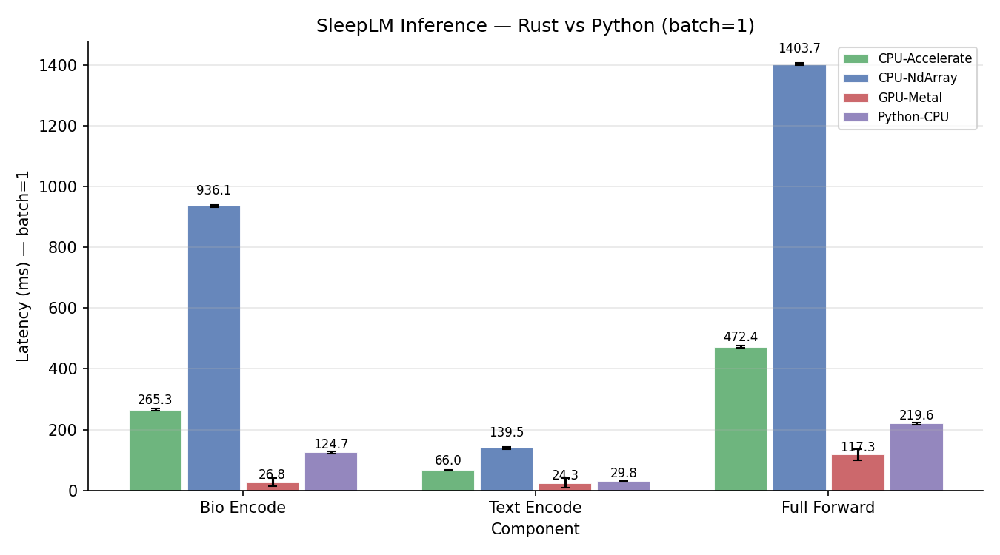
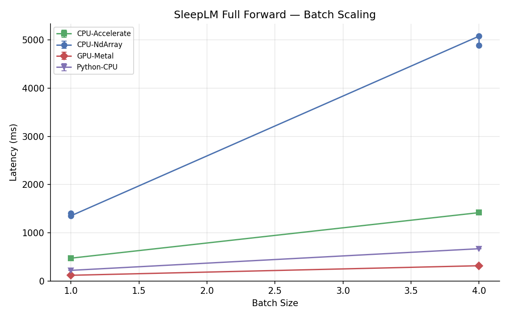
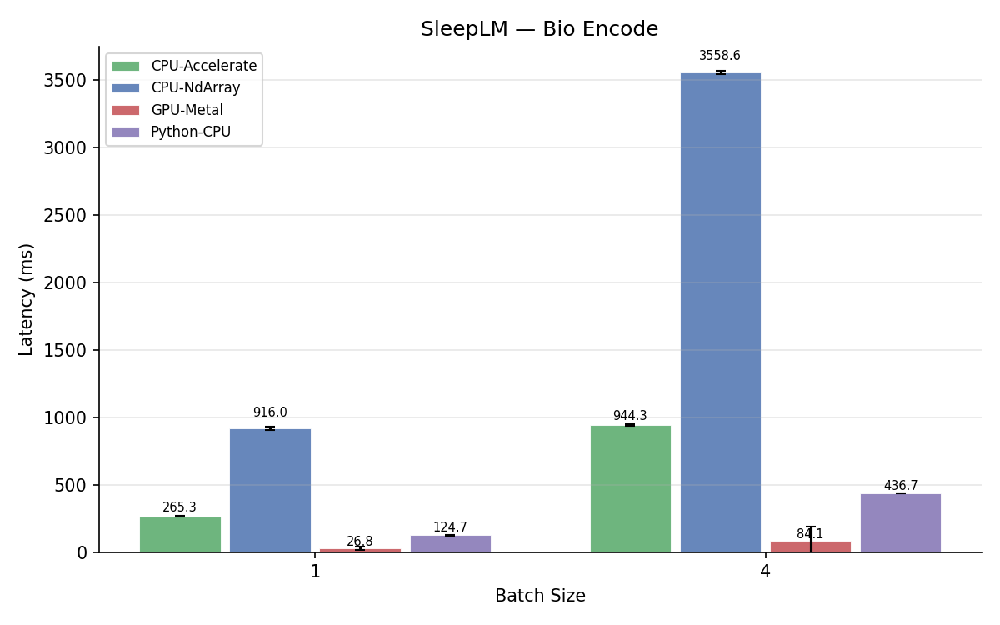
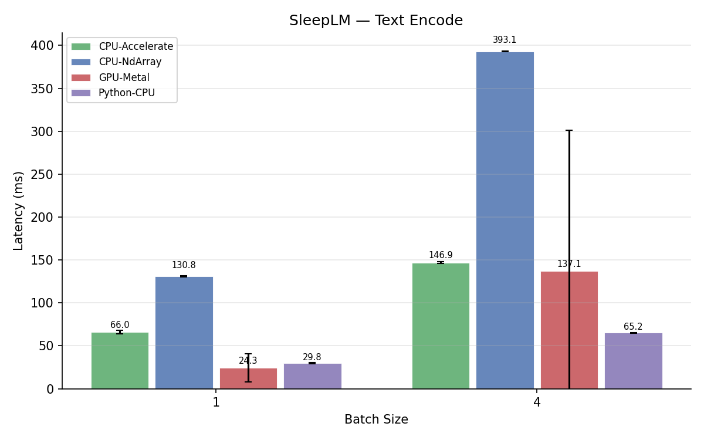
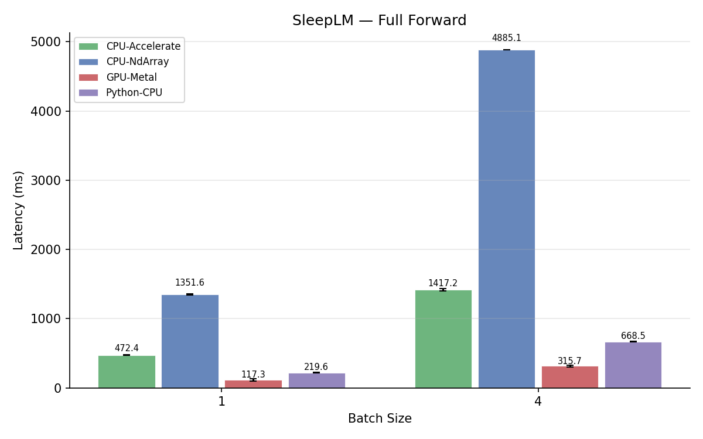

# sleeplm — SleepLM inference in Rust

Pure-Rust inference for the **SleepLM** (Sleep Language Model) foundation model,
built on [Burn 0.20](https://burn.dev).

SleepLM is a multimodal CoCa (Contrastive Captioners) model that aligns
polysomnography (PSG) biosignals with natural language. It encodes 30-second
sleep epochs (10 channels × 1920 samples @ 64 Hz) into a shared embedding
space with text.

Paper: [SleepLM: Natural-Language Intelligence for Human Sleep](https://arxiv.org/abs/2602.23605)

## Architecture

| Component | Description |
|-----------|-------------|
| **Biosignals Encoder** | Dual-axis transformer (channel + temporal RoPE attention), SwiGLU, RMSNorm, CoCa attentional pooling |
| **Text Encoder** | CLIP-style 12-layer causal transformer, BPE tokenizer (49K vocab) |
| **Text Decoder** | 12-layer cross-attention transformer with prefix-causal masking for modality conditioning |

~385M parameters, embed_dim=512, width=768.

## Quick start

### Build

```bash
# CPU (default — NdArray + Rayon)
cargo build --release

# CPU with Apple Accelerate BLAS
cargo build --release --features blas-accelerate

# GPU (Metal on macOS)
cargo build --release --no-default-features --features metal
```

### Generate test data

```bash
cargo run --bin gen_sample_psg --release
```

### Run inference

```bash
# Convert PyTorch weights to safetensors first (requires Python)
python3 scripts/convert_to_safetensors.py \
    --input model_checkpoint.pt \
    --output model.safetensors

# Run inference
cargo run --bin infer --release -- \
    --config data/sleep_coca_base_dualtransformer.json \
    --weights model.safetensors
```

## Input format

SleepLM expects a **30-second epoch**, sampled at **64 Hz** → **1920 samples/channel**, with **10 channels**:

| Index | Channel | Description |
|------:|---------|-------------|
| 0 | ECG | Electrocardiogram |
| 1 | ABD | Abdominal respiratory effort |
| 2 | THX | Thoracic respiratory effort |
| 3 | AF | Airflow |
| 4 | EOG_E1 | Left eye movement |
| 5 | EOG_E2 | Right eye movement |
| 6 | EEG_C3 | Left central EEG |
| 7 | EEG_C4 | Right central EEG |
| 8 | EMG_Chin | Chin muscle tone |
| 9 | POS | Body position (encoded) |

### Body position encoding

| Value | Position |
|------:|----------|
| 0 | Right |
| 1 | Left |
| 2 | Supine |
| 3 | Prone |
| 4 | Upright |
| -1 | Other/Unknown |

## Modality conditioning

Caption generation can be conditioned on specific body systems:

| Index | Modality | Description |
|------:|----------|-------------|
| 0 | brain | EEG, EOG — sleep staging, brain activity |
| 1 | heart | ECG — cardiac rhythm |
| 2 | respiratory | ABD, THX, AF — breathing patterns |
| 3 | position_muscle | EMG, POS — body position and muscle tone |
| 4 | stage_event | Combined holistic description |

## Benchmarks

Measured on Apple Silicon (M-series), batch=1, random weights, 3 iterations after 1 warmup.

### Summary (batch=1)



| Component | Rust CPU (NdArray) | Rust CPU (Accelerate) | Rust GPU (Metal) | Python CPU (PyTorch) |
|-----------|------------------:|---------------------:|------------------:|---------------------:|
| **Bio Encode** | 936 ms | 265 ms | **27 ms** | 125 ms |
| **Text Encode** | 140 ms | 66 ms | **24 ms** | 30 ms |
| **Full Forward** | 1404 ms | 472 ms | **117 ms** | 220 ms |

- **Rust GPU (Metal)** is the fastest — **1.9× faster** than PyTorch CPU on full forward
- **Rust CPU + Accelerate BLAS** is **2.1× faster** than PyTorch CPU on bio encoding, **2.2× faster** on text encoding
- **Rust CPU (plain NdArray)** without BLAS is ~3× slower — all matmuls fall back to pure-Rust Rayon loops

### Batch scaling



### Per-component breakdown

| | |
|---|---|
|  |  |
|  | |

### Reproduce

```bash
# Single build, runs both CPU + GPU:
cargo build --release --bin bench --features metal
cargo run --release --bin bench --features metal

# Python baseline:
python3 scripts/bench_python.py --device cpu

# Generate charts:
python3 scripts/plot_bench.py
```

Raw CSV data: [`figures/all_results.csv`](./figures/all_results.csv)

## Crate structure

```
src/
├── lib.rs              — public API re-exports
├── config.rs           — ModelConfig, BiosignalsCfg, TextCfg, MultimodalCfg
├── data.rs             — InputBatch, z-score normalization
├── encoder.rs          — SleepLMEncoder high-level API
├── weights.rs          — safetensors weight loader
└── model/
    ├── norm.rs              — RMSNorm, LayerNorm
    ├── rope.rs              — Interleaved RoPE (fixed + learnable)
    ├── channel_patching.rs  — Conv1d patch tokenizer
    ├── dual_attention.rs    — Channel/temporal attention, SwiGLU MLP
    ├── dual_transformer_block.rs — Factorized channel+temporal block
    ├── attn_pooler.rs       — CoCa attentional pooler
    ├── biosignals_encoder.rs — Full biosignals encoder
    ├── text_encoder.rs      — CLIP text encoder
    ├── text_decoder.rs      — Cross-attention text decoder
    └── sleeplm.rs           — Full BiosignalsCoCa model
```

## Features

| Feature | Description |
|---------|-------------|
| `ndarray` (default) | CPU backend with Rayon multi-threading |
| `blas-accelerate` | Apple Accelerate BLAS (macOS) |
| `openblas-system` | System OpenBLAS (Linux) |
| `wgpu` | GPU via wgpu (auto-detects Metal/Vulkan/DX12) |
| `metal` | Native Metal shaders (macOS) |
| `vulkan` | Native Vulkan/SPIR-V shaders |
| `hf-download` | Download weights from HuggingFace Hub |

## License

MIT — same as the original SleepLM.

## Citation

```bibtex
@article{xu2026sleeplm,
  title={SleepLM: Natural-Language Intelligence for Human Sleep},
  author={Xu, Zongzhe and Shuai, Zitao and Mozaffari, Eideen and Aysola, Ravi S and Kumar, Rajesh and Yang, Yuzhe},
  journal={arXiv preprint arXiv:2602.23605},
  year={2026}
}
```

## Acknowledgments

- Model architecture: [SleepLM (yang-ai-lab)](https://github.com/yang-ai-lab/SleepLM)
- ML framework: [Burn](https://burn.dev)
- Inspired by: [luna-rs](https://github.com/eugenehp/luna-rs)
